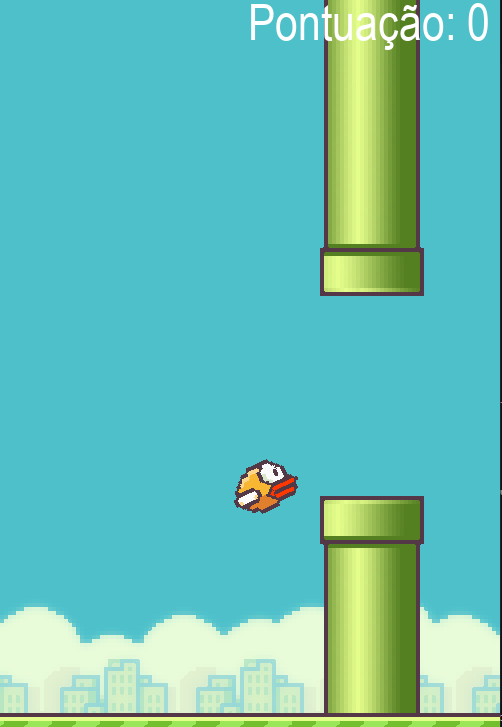

<h1 align="center">
  Flappy Bird
</h1>


<p align="center">
  <a href="#-Technologies"><b>Technologies</b></a>&nbsp;&nbsp;&nbsp;|&nbsp;&nbsp;&nbsp;
  <a href="#-Project"><b>Project</b></a>&nbsp;&nbsp;&nbsp;
</p>

<br>

<h1 align="center">
  
</h1>


## 🚀 Getting started

Clone the project and access the folder.

```bash
$ git clone https://github.com/diaspd/Flappy-Bird.git
$ cd 
```

Follow the steps below:
```bash
# Install the dependencies
$ pip intall random
$ pip intall os

# Start the project
$ run the file on your terminal
```

<br></br>

## 💻 Technologies

This project was developed with the following technologies:
<b>
- Python
</b>

<br> </br> 

## 📄 Project
💰 A flappy bird game recreation.

<br> </br>

Feito com ♥ by Pedro Dias. 👋 Me siga nas redes sociais! <br></br>
https://www.instagram.com/dias_pdr/ <br></br>
https://www.facebook.com/PedroDias24/<br></br>
https://twitter.com/diaspdr_1<br></br>
https://www.twitch.tv/diasgm_pdr<br></br>

Se puder dar uma estrelinha, eu agradeço 🤩

If you can give a little star, I appreciate it 🤩
